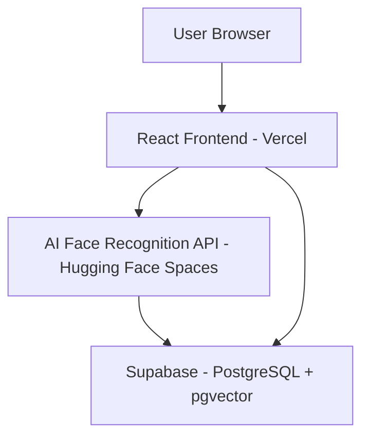
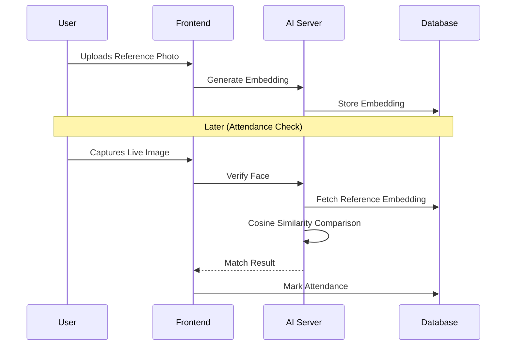
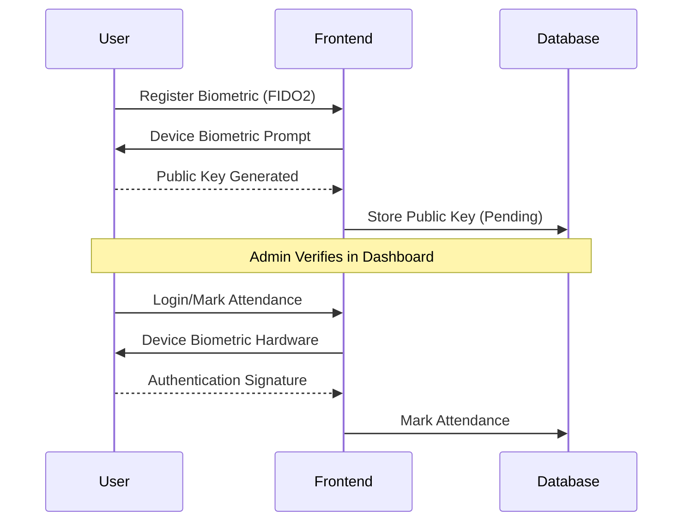
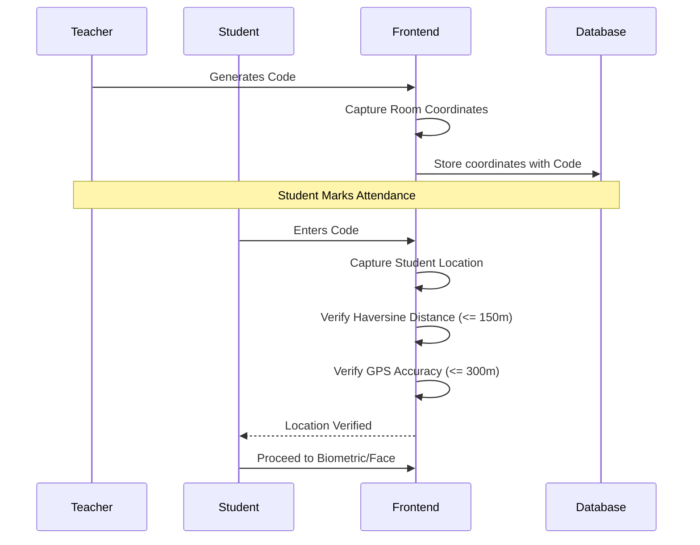

# FaceAttendERP – AI Powered Attendance Management System

[](https://reactjs.org/)
[](https://fastapi.tiangolo.com/)
[](https://supabase.com/)
[](https://github.com/serengil/deepface)
[](https://face-attend-erp.vercel.app)

FaceAttendERP is a modern AI-powered attendance management system that uses **face recognition technology** to automate student and employee attendance tracking.

The system integrates a **React frontend**, **FastAPI AI backend**, and **Supabase database** to provide a scalable cloud-based solution.

---

# 🌐 Live Demo

- **Frontend (Production)**: [https://face-attend-erp.vercel.app/](https://face-attend-erp.vercel.app/)
- **AI Backend API (Swagger Docs)**: [https://renukp25-face-attend-api.hf.space/docs](https://renukp25-face-attend-api.hf.space/docs)

---

# 📌 Project Overview

Traditional attendance systems rely on **manual entry, RFID cards, or QR codes**, which can lead to fraud and inefficiency.

FaceAttendERP solves this by:
- Capturing a user's face
- Generating a **DeepFace embedding**
- Verifying identity using AI
- Automatically marking attendance

---

# 🚀 Key Features

### 👥 Multi-Role System
Supports multiple user roles:
- **Admin**: Full system control and user management.
- **Teacher**: Schedule classes and manage attendance.
- **Student**: View attendance and profile.

---

### 🤖 AI Face Verification
Attendance is verified using:
- **DeepFace** (FaceNet model)
- **Cosine similarity** comparison
- Secure embedding storage

---

### 🔑 Biometric (Fingerprint) Authentication
A secure alternative to face recognition:
- **WebAuthn / Passkeys** technology.
- Device-level biometric security (fingerprint/Windows Hello).
- Privacy-focused: Biometric data stays on the user's device.
- Requires Admin manual verification for activation.

---

### 📍 Location-Based Verification (Geofencing)
Prevents remote and proxy attendance by enforcing physical presence:
- **Dual-Coordinate Verification**: Matches student location with teacher's room coordinates.
- **Precision Geofencing**: Configurable 150m radius around the classroom.
- **Anti-Spoofing**: High-accuracy GPS threshold (300m accuracy) prevents simulated locations.
- **Privacy First**: Temporary location access used only during the verification step.

---

### 🧾 Attendance Integrity
Each attendance record stores:
- Student snapshot (for face verification)
- Geolocation metadata (latitude/longitude verification status)
- Biometric verification status
- Teacher snapshot
- Timestamp
- Class metadata

This prevents historical data corruption.

---

### 📅 Timetable Management
Teachers can:
- Create schedules
- Hold classes
- Modify lecture timings

---

### 🛠 Admin Controls
Admins can:
- Manage users, classes, and subjects.
- Resolve attendance issues and disputes.

---

### 🔐 Profile Security
Critical profile changes trigger:
- Re-verification workflows.
- Admin approval processes.

---

# 🏗 System Architecture

The attendance process follows a **Multi-Factor Verification** flow:
1. **Class Code** (Knowledge-based)
2. **Geofencing** (Location-based)
3. **Biometrics** (Possession-based)
4. **Face Matching** (Inherent-based)



---

# 🛠 Technology Stack

### Frontend
- **React** & **Vite**
- **TypeScript**
- **TailwindCSS**
- **Lucide Icons**
- **WebAuthn API** (Biometrics)

### Backend (AI)
- **Python** & **FastAPI**
- **DeepFace** & **OpenCV**
- **NumPy**

### Database
- **Supabase** (PostgreSQL)
- **pgvector** extension

### Hosting
- **Frontend**: Vercel
- **AI Server**: Hugging Face Spaces

---

# 📁 Project Folder Structure

```text
faceid-class-manager-main
├── public/
├── src/
│   ├── components/
│   ├── pages/
│   ├── hooks/
│   ├── services/
│   └── utils/
├── supabase/
│   └── migrations/
├── index.html
├── package.json
├── vite.config.ts
├── tailwind.config.ts
├── tsconfig.json
└── README.md
```

---

# 💻 Installation Guide

## 1️⃣ Clone Repository

```bash
git clone https://github.com/your-username/FaceAttendERP.git
cd faceid-class-manager-main
```

## 2️⃣ Install Frontend Dependencies

```bash
npm install
```

## 3️⃣ Create Environment File

Create a `.env` file in the root directory:

```env
VITE_SUPABASE_PROJECT_ID=your_project_id
VITE_SUPABASE_URL=your_supabase_url
VITE_SUPABASE_PUBLISHABLE_KEY=your_supabase_anon_key
VITE_AI_SERVER_URL=https://renukp25-face-attend-api.hf.space
```

## 4️⃣ Run Frontend

```bash
npm run dev
```

Application will run on: `http://localhost:5173`

---

## 🤖 AI Server Setup (Optional Local Development)

If you want to run the AI server locally:

### Create Python Environment
```bash
python -m venv .venv
```

### Activate environment
**Windows**:
```powershell
.venv\Scripts\activate
```
**Mac / Linux**:
```bash
source .venv/bin/activate
```

### Install Python Dependencies
```bash
pip install fastapi uvicorn deepface opencv-python supabase python-dotenv numpy pillow
```

### Start AI Server
```bash
python face_server.py
```
Server runs on: `http://localhost:8000`

---

# ☁ Deployment

### Deploy AI Server to Hugging Face
1. Create a **Hugging Face Space**.
2. Select **Docker SDK**.
3. Upload files: `face_server.py`, `requirements.txt`, `Dockerfile`.
4. Add environment secrets: `SUPABASE_URL`, `SUPABASE_SERVICE_ROLE_KEY`.

Your API will be available at: `https://<username>-face-attend-api.hf.space`

### Deploy Frontend to Vercel
1. Push project to GitHub.
2. Open [Vercel](https://vercel.com).
3. Import repository.
4. Add environment variables:
   - `VITE_SUPABASE_PROJECT_ID`
   - `VITE_SUPABASE_URL`
   - `VITE_SUPABASE_PUBLISHABLE_KEY`
   - `VITE_AI_SERVER_URL`
5. Deploy.

---

# 🔍 Verification Workflows

### Face Recognition Workflow


### Biometric (Fingerprint) Workflow


---

### Location Verification (Geofencing) Workflow


---

# 🔗 API Endpoints

### Generate Face Embedding
`POST /generate-embedding`

### Verify Face
`POST /verify-face`

### Swagger Documentation
[https://renukp25-face-attend-api.hf.space/docs](https://renukp25-face-attend-api.hf.space/docs)

---

# 🚀 Future Improvements

- [ ] Mobile application (iOS/Android)
- [ ] Liveness detection to prevent spoofing
- [ ] Attendance analytics dashboard
- [ ] HRMS integration
- [x] Biometric multi-factor authentication
- [x] Location-based Geofencing security

---

# 📄 License

**MIT License** - Free to use, modify, and distribute.

---

### 👨‍💻 Author
**FaceAttendERP Project**